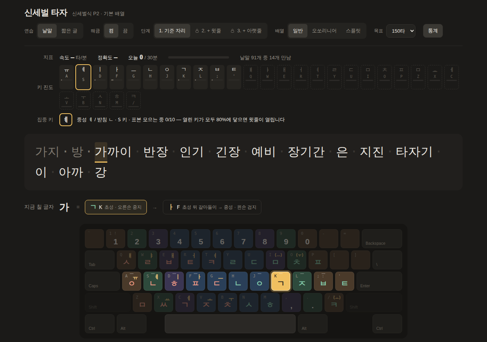

# 신세벌 타자

신세벌식 P2와 세모이, 두 세벌식 자판을 익히는 웹 타자 연습기입니다.

https://kaorw.github.io/sebeol-type/



세벌식 자판은 배우는 과정에서 헷갈리는 지점이 두벌식과 다릅니다. P2에서는 같은 왼손 키가 첫소리 바로 뒤에서는 홀소리, 그 뒤에서는 받침이 됩니다. 세모이에서는 한 글자를 이루는 키 서너 개를 한꺼번에 눌러야 합니다. 이 연습기는 칠 글자를 키 단위로 풀어서 보여 주고, 키보드 그림에 누를 키와 손가락을 표시합니다.

입력 판정은 물리 키 자리(`KeyboardEvent.code`)로 합니다. 컴퓨터에 신세벌식이나 세모이 입력기를 설치하지 않아도 되고, 한/영 상태도 상관없습니다. 설치할 것도, 로그인도 없습니다.

## 쓰는 법

1. 실제 키보드가 달린 컴퓨터에서 사이트를 엽니다.
2. 위쪽 `자판`에서 신세벌식 P2나 세모이를, `배열`에서 쓰는 키보드 모양을 고릅니다.
3. 화면에 나온 글을 칩니다. `Esc`를 누르면 새 글이 나옵니다.

연습 기록은 그 브라우저의 localStorage에만 남습니다. 다른 기기나 브라우저에서는 처음부터 시작합니다. 주소 뒤에 `?scheme=semoe` 또는 `#semoe`를 붙이면 세모이로 바로 열립니다.

## 자판

### 신세벌식 P2

키를 차례로 치는 이어치기 자판입니다.

| 손 | 맡는 낱자 | 키 |
|---|---|---|
| 오른손 | 첫소리 | Y U I O P · H J K L ; ' · N M / |
| 왼손 | 받침. 첫소리 바로 뒤에서는 가운뎃소리 | Q W E R T · A S D F G · Z X C V B |

- 된소리는 같은 첫소리 키를 두 번 칩니다. `K K` = ㄲ
- 겹홀소리는 오른손 `/`(ㅗ) `O`(ㅜ) `I`(ㅡ)로 시작합니다. 과 = `K / F`, 워 = `J O R`, 의 = `J I D`
- 겹받침은 받침 키를 이어 칩니다. 없 = `J R E Q`, 밖 = `; F C C`

화면은 `과 = K(초성 ㄱ) → /(오른쪽 ㅗ) → F(겹홀소리 ㅘ)`처럼 타마다 무엇이 들어가는지 적어 줍니다. 배열 설계는 [팥알 님의 글](https://pat.im/1136)에 있습니다.

### 세모이 (세벌식 모아치기 e)

한 글자의 키를 한꺼번에 눌렀다 떼는 모아치기 자판입니다. 키를 누르는 순서는 상관없습니다.

| 손 | 맡는 낱자 | 키 |
|---|---|---|
| 오른손 | 첫소리 ㅁ ㄴ ㄷ ㅂ ㅎ ㅇ ㄱ ㅈ ㅅ ㄹ | Y U I O · H J K L · N M |
| 오른손 | 받침 ㅆ, 겹홀소리용 ㅗ | `;` · `.` |
| 왼손 | 가운뎃소리 ㅓ ㅕ ㅣ ㅏ ㅡ ㅔ ㅗ ㅜ | R T · D F G · C V B |
| 왼손 | 받침 ㅅ ㅂ ㄹ ㅇ ㄴ ㅁ ㄱ | Q W E · A S · Z X |

- 거센소리와 된소리 첫소리는 ㅎ(H)이나 ㅇ(J)과 함께 누릅니다. 타 = `I H F`, 까 = `J K F`
- 겹홀소리는 `.`과 함께 누릅니다. 과 = `K . F`, 요 = `J . V`
- 배열에 없는 받침은 `;`과 함께 누릅니다. 있 = `J D ;`, 좋 = `L V ; S`

화면에는 `과 = K(ㄱ) + .(ㅗ) + F(ㅏ)`처럼 한 번에 누를 키를 보여 줍니다. 모든 키를 떼는 순간 판정하고, 틀리면 방금 누른 키가 어떤 글자가 되었는지 보여 줍니다. 권하는 조합이 아니어도 같은 글자가 되는 조합(과 = `K V F`)은 맞은 것으로 칩니다. 글자 키와 스페이스를 함께 누르면 띄어쓰기까지 한 번에 친 것으로 봅니다.

결합 규칙은 [온라인 한글 입력기의 세모이 구현](https://github.com/Sinseiki/ohi)을 따릅니다. 연습 글에 나오는 음절 1,022개를 권하는 조합으로 [세모이 타자연습](https://semoi-typing.pages.dev/)에 쳐 보고 모두 같은 글자가 나오는 것을 확인했습니다. 세모이의 약어(줄임말)는 아직 연습할 수 없습니다.

## 연습 구성

키보드는 기준 자리(홈 행)에서 시작해 한 줄씩 열립니다. 열린 키만으로 칠 수 있는 낱말이 나옵니다.

낱말은 두 목록을 합쳐 69,605개입니다. 국립국어원 「한국어 학습용 어휘 목록」 5,545개를 먼저 두고, 「현대 국어 사용 빈도 조사」의 일반어·고유명사·조사·어미 64,060개를 빈도가 높은 차례로 붙였습니다. 출제는 아직 안 나온 낱말부터 하되, 자주 쓰는 낱말이 먼저 나오도록 순위에 무게를 둡니다.

| 단계 | P2 낱말 수 | 세모이 낱말 수 |
|---|---|---|
| 1. 기준 자리 | 500 | 529 |
| 2. + 윗줄 | 7,867 | 7,414 |
| 3. + 아랫줄 | 69,605 | 69,605 |

- 키마다 속도와 정확도를 따로 잽니다. 열린 키가 모두 목표 속도 기준 80%에 닿으면 다음 줄이 열립니다.
- 낱말은 무작위로 뽑되, 진도가 낮거나 자주 틀리는 키가 든 낱말이 더 자주 나오도록 무게를 둡니다.
- 틀리면 잘못 누른 키의 기록에 오타가 남습니다. 모아치기에서는 빠뜨린 키와 더 누른 키에 남고, 맞게 누른 키는 그대로입니다.
- 해금을 끄고 연습할 키를 직접 고를 수도 있습니다.
- `짧은 글`에서는 문장, 속담, 옛 소설 문장을 칩니다. 원하는 글을 붙여 넣어 연습할 수도 있습니다.
- `통계`에서 키별 숙련도 지도와 최근 연습의 속도·정확도를 봅니다.
- 기록은 자판마다 따로 둡니다.

세모이의 속도(타/분)는 맞게 친 글자에 든 키 수로 셉니다. 두 자판의 속도를 같은 눈금으로 비교하기 위해서입니다.

## 키보드 배열

일반(행 엇갈림), 오쏘리니어, 스플릿, Ergo 네 가지 모양을 그릴 수 있습니다. 모양에 따라 키마다 칠 손가락이 달라지고, 다음에 누를 키 위에 `왼검지` 같은 이름표가 붙습니다.

Ergo는 열 엇갈림(column stagger) 스플릿 키보드입니다. 가운뎃손가락 열(E, I)이 가장 높고 새끼손가락 열이 가장 낮으며, 오른쪽 바깥에 B 키가 하나 더 있습니다. 엄지 줄은 그리지 않고 양쪽 아래에 작은 스페이스바를 둡니다. 이 배열에는 `'`와 `/` 키가 없어서 P2의 ㅌ(`'`)과 ㅋ(`/`)은 키보드 그림에 나오지 않습니다.

## 출처와 이용 조건

| 자료 | 출처 | 조건 |
|---|---|---|
| 자판 배열 | 신세벌식 P2, 팥알 ([pat.im/1136](https://pat.im/1136)) | 배열 설계자 표기 |
| 자판 배열 | 세모이, 신세기 ([Semo-e_keyboard](https://github.com/Sinseiki/Semo-e_keyboard)) | CC BY-SA 4.0 |
| 낱말 5,545개 | 국립국어원 「한국어 학습용 어휘 목록」 | 공공누리 제1유형(출처 표시) |
| 낱말 64,060개 | 국립국어원 「현대 국어 사용 빈도 조사」 단어 목록(일반어·고유명사·조사·어미) | 출처 표시 |
| 문학 38문장 | 현진건 「운수 좋은 날」(1924), 김동인 「배따라기」(1921), 나도향 「벙어리 삼룡이」(1925), 원문 [위키문헌](https://ko.wikisource.org) | 저작권 보호기간 만료 |
| 속담 40개 | 전래 속담 | — |
| 문장 154개 | 이 프로젝트에서 직접 씀 | — |

문학 문장에서는 기본 배열로 칠 수 없는 따옴표와 한자 병기를 뺐고, 「벙어리 삼룡이」는 오늘날 맞춤법으로 옮겼습니다. `src/layout/semoe.ts`의 세모이 배열·결합 규칙은 원 배열의 조건(CC BY-SA 4.0)을 따릅니다.

## 개발

```bash
npm install
npm run dev      # 개발 서버
npm test         # 조합 엔진, 입력기 대조, 어휘·글감 전체 왕복 테스트
npm run build    # 정적 파일 → dist/
```

| 경로 | 내용 |
|---|---|
| `src/scheme.ts` | 자판(P2·세모이) 선택. 화면·출제·통계는 고른 자판만 본다 |
| `src/engine/` | P2 이어치기 엔진, 세모이 모아치기 엔진 (키 → 글자, 글자 → 키) |
| `src/layout/` | P2·세모이 배열, 물리 배열(일반·오쏘리니어·스플릿·Ergo)과 손가락 배정 |
| `src/app/` | 출제, 숙련도, 글감(`texts.ts`), 내 글감 |
| `src/main.ts` | 화면 |
| `data/` | 정제된 어휘와 단계별 집계. `data/freq/`는 빈도 조사 원본, `npm run vocab:freq`로 `vocab-freq.json`을 다시 만든다 |
| `deploy/` | 직접 서버에 올릴 때 쓰는 Docker·nginx 설정 |

`main`에 올리면 GitHub Actions가 테스트와 빌드를 거쳐 GitHub Pages에 배포합니다. 글감은 `src/app/texts.ts`에 한 줄씩 넣으면 되고, 칠 수 없는 글자가 섞이면 테스트가 알려 줍니다. 구현 기록은 [docs/DEVELOPMENT.md](docs/DEVELOPMENT.md)에 있습니다.
